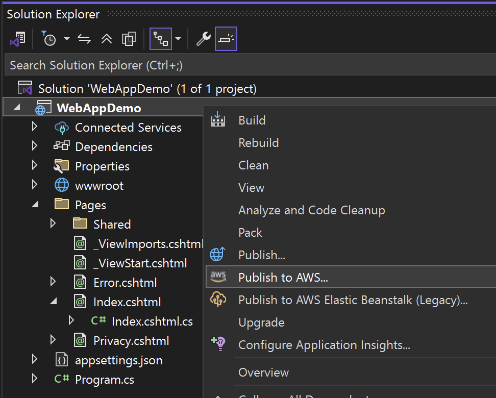
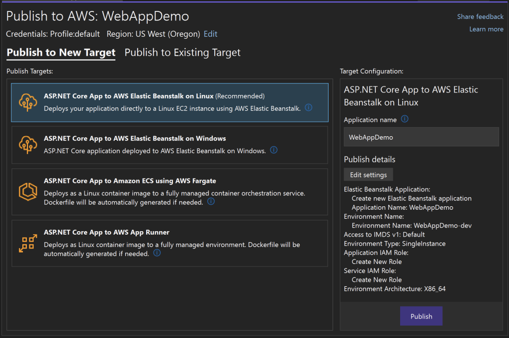
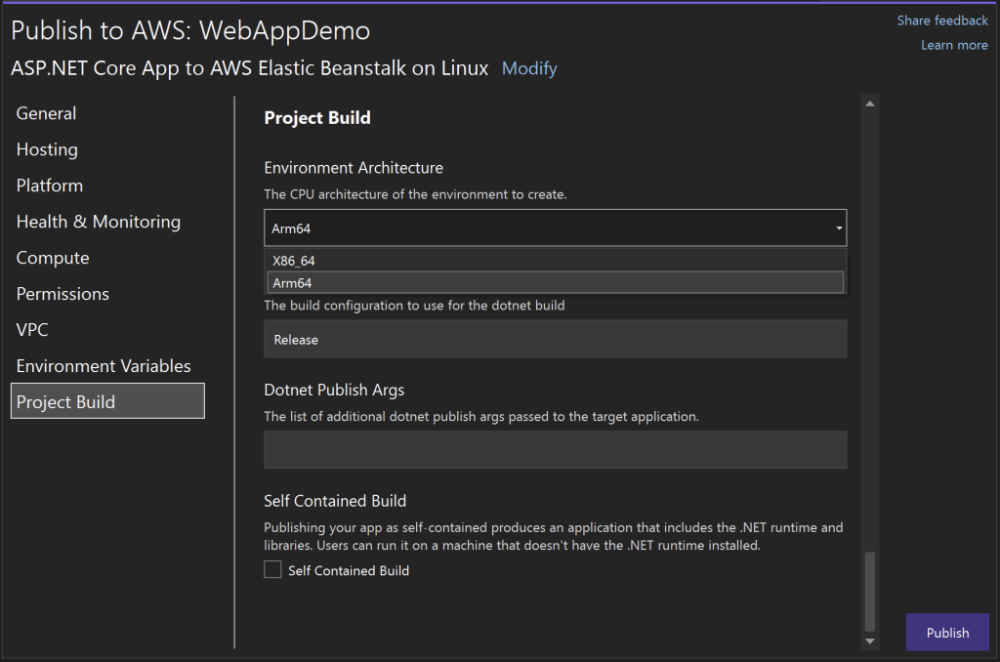
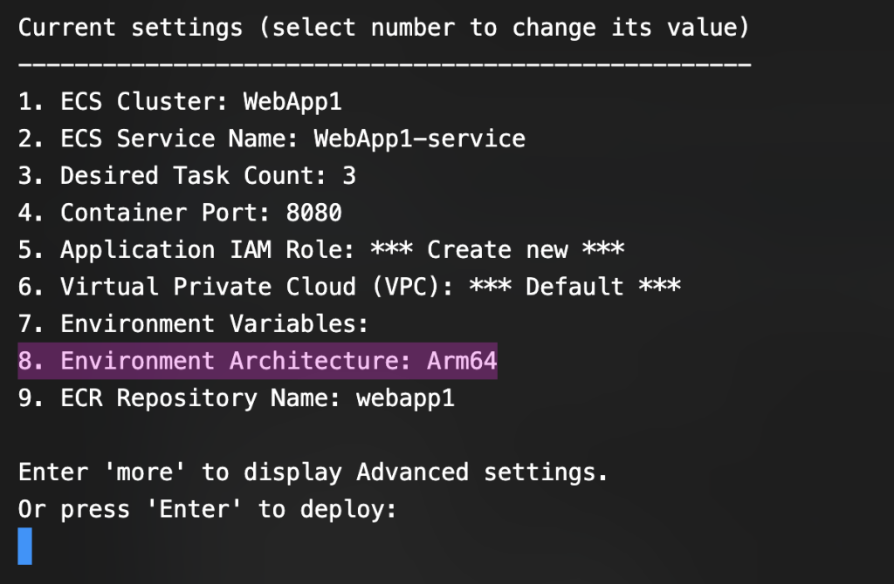

# **Triển khai lên Hệ thống Tính toán Dựa trên ARM với Công cụ Triển khai AWS cho .NET**

📖 **Bài viết gốc**: Deploy to ARM-Based Compute with AWS Deploy Tool for .NET  
👤 **Tác giả**:  Philippe El Asmar, Kỹ sư Phát triển Phần mềm, Nhóm SDK .NET tại AWS  
📅 **Ngày xuất bản**: 08 tháng 5 năm 2025  
🌐 **Nguồn**: AWS Developer Blog  
👨‍💻 **Người dịch**: Nguyễn Thanh Tùng \- FCJ Intern  
📅 **Ngày dịch**: 09 tháng 7 năm 2025  
⏱️ **Thời gian đọc**: 5 phút  
---

📋 Tóm tắt  
Bài viết công bố bản cập nhật của Công cụ Triển khai AWS cho .NET, nay hỗ trợ triển khai ứng dụng .NET lên các nền tảng tính toán dựa trên ARM như AWS Graviton. Công cụ này cho phép các nhà phát triển tận dụng các hệ thống ARM hiệu quả về chi phí và tiết kiệm năng lượng mà không cần thay đổi quy trình triển khai hiện tại. Hướng dẫn chi tiết được cung cấp để triển khai từ Visual Studio hoặc .NET CLI, với các bước đơn giản để chọn mục tiêu triển khai như AWS Elastic Beanstalk hoặc Amazon ECS sử dụng AWS Fargate với kiến trúc Arm64. Bản cập nhật giúp các nhà phát triển .NET dễ dàng tận dụng lợi ích về giá và hiệu suất của Graviton, đồng thời duy trì quy trình làm việc liền mạch. Bài viết cũng khuyến khích thử nghiệm, khám phá tài liệu và đóng góp ý tưởng cải tiến thông qua GitHub.  
🎯 **Đối tượng đọc**: Các nhà phát triển .NET, kỹ sư phần mềm sử dụng AWS  
📊 **Độ khó**: Trung cấp  
🏷️ **Tags**: [.NET](https://aws.amazon.com/blogs/developer/tag/net/), [deploy](https://aws.amazon.com/blogs/developer/tag/deploy/), [deployment](https://aws.amazon.com/blogs/developer/tag/deployment/), [dotnet](https://aws.amazon.com/blogs/developer/tag/dotnet/)  
---

📚 Mục lục

* Phần 1: Giới thiệu  
* Phần 2: Implementation  
* Kết luận  
* Glossary \- Thuật ngữ  
* Tài liệu tham khảo

---

## Phần 1: Giới thiệu

Chúng tôi rất hào hứng thông báo rằng [Công cụ Triển khai AWS cho .NET](https://github.com/aws/aws-dotnet-deploy/) hiện hỗ trợ triển khai các ứng dụng .NET lên các nền tảng tính toán dựa trên ARM được chọn trên AWS\! Dù bạn triển khai từ Visual Studio hay sử dụng .NET CLI, giờ đây bạn có thể nhắm đến cơ sở hạ tầng ARM hiệu quả về chi phí như [AWS Graviton](https://aws.amazon.com/ec2/graviton/) với trải nghiệm triển khai mượt mà như trước đây.

### Tại sao nên triển khai lên ARM?

Các phiên bản dựa trên ARM, chẳng hạn như [AWS Graviton](https://aws.amazon.com/ec2/graviton/), mang lại hiệu suất giá cả tuyệt vời và tiết kiệm năng lượng, khiến chúng trở thành lựa chọn thông minh cho nhiều khối lượng công việc .NET. Với bản cập nhật này, bạn có thể tận dụng tối đa lợi ích của ARM trên các dịch vụ được hỗ trợ mà không cần thay đổi cách triển khai ứng dụng của mình.  
Nếu bạn đã sử dụng Công cụ Triển khai AWS cho .NET, việc triển khai lên ARM đơn giản như chọn một tùy chọn tính toán dựa trên ARM như [AWS Elastic Beanstalk](https://aws.amazon.com/elasticbeanstalk/) hoặc [Amazon Elastic Container Service (ECS)](https://aws.amazon.com/ecs/) sử dụng [AWS Fargate](https://aws.amazon.com/fargate/).

## Phần 2: Implementation

### Bắt đầu trong Visual Studio

Để bắt đầu trong Visual Studio, cài đặt phiên bản mới nhất của [AWS Toolkit for Visual Studio](https://aws.amazon.com/visualstudio/) từ [Visual Studio Marketplace](https://marketplace.visualstudio.com/items?itemName=AmazonWebServices.AWSToolkitforVisualStudio2022), nơi nó còn được gọi là [AWS Toolkit with Amazon Q](https://marketplace.visualstudio.com/items?itemName=AmazonWebServices.AWSToolkitforVisualStudio2022). Sau khi cài đặt toolkit và cấu hình thông tin xác thực AWS, nhấp chuột phải trong Solution Explorer vào dự án cần triển khai và chọn mục Publish to AWS….  
  
Từ đó, chọn một trong các Mục tiêu Triển khai sau, nay đã được cập nhật để hỗ trợ kiến trúc dựa trên ARM:

* Ứng dụng ASP.NET Core lên供水

System: dụng AWS Elastic Beanstalk trên Linux

* Ứng dụng ASP.NET Core trên Amazon ECS sử dụng AWS Fargate  
* Nhiệm vụ Lên lịch trên Amazon Elastic Container Service (ECS) sử dụng AWS Fargate  
* Dịch vụ trên Amazon Elastic Container Service (ECS) sử dụng AWS Fargate

Ở phía bên phải, trong Cấu hình Mục tiêu, chọn Chỉnh sửa cài đặt. Trên màn hình cài đặt, chọn Xây dựng Dự án trong bảng bên trái và sau đó chuyển Kiến trúc Môi trường sang Arm64.  

Cuối cùng, nhấp vào Publish để bắt đầu triển khai ứng dụng dựa trên ARM.

### Bắt đầu từ .NET CLI

Để bắt đầu từ .NET CLI, bạn chỉ cần chạy lệnh sau để cài đặt công cụ từ NuGet:  
dotnet tool install \--global Aws.Deploy.Tools  
Sau khi công cụ được cài đặt, chạy lệnh sau để bắt đầu trải nghiệm triển khai:  
dotnet aws deploy  
CLI sẽ hướng dẫn bạn chọn Tùy chọn Triển khai. Chọn một tùy chọn hỗ trợ triển khai lên kiến trúc dựa trên ARM và sau đó cập nhật cài đặt Kiến trúc Môi trường thành Arm64.  

Khi bạn hoàn tất cập nhật cài đặt triển khai, nhấn Enter để bắt đầu triển khai.

## Kết luận

Với sự hỗ trợ cho các tùy chọn tính toán dựa trên ARM hiện có trong [AWS Deploy Tool for .NET](https://github.com/aws/aws-dotnet-deploy/), việc triển khai các ứng dụng .NET lên cơ sở hạ tầng được hỗ trợ bởi Graviton trở nên dễ dàng hơn bao giờ hết. Bạn có thể tận hưởng hiệu suất giá cả được cải thiện với những thay đổi tối thiểu đối với quy trình làm việc hiện tại.

### Các bước tiếp theo:

* Thử triển khai ứng dụng .NET của bạn lên hệ thống tính toán dựa trên ARM bằng cách cài đặt hoặc cập nhật phiên bản mới nhất của [AWS Deploy Tool for .NET](https://github.com/aws/aws-dotnet-deploy)  
* Khám phá [Hướng dẫn Nhà phát triển](https://aws.github.io/aws-dotnet-deploy/) và xem [GitHub repo](https://github.com/aws/aws-dotnet-deploy) của chúng tôi để biết thêm tài liệu và dự án mẫu.  
* Đừng ngần ngại tạo một [issue](https://github.com/aws/aws-dotnet-deploy/issues) hoặc [pull request](https://github.com/aws/aws-dotnet-deploy/pulls) nếu bạn có ý tưởng cải tiến.

## Glossary \- Thuật ngữ

| English | Tiếng Việt | Định nghĩa |
| :---- | :---- | :---- |
| ARM | ARM | Kiến trúc bộ xử lý hiệu quả năng lượng được sử dụng trong AWS Graviton |
| AWS Graviton | AWS Graviton | Bộ xử lý dựa trên ARM của AWS, cung cấp hiệu suất giá cả cao |
| AWS Elastic Beanstalk | AWS Elastic Beanstalk | Dịch vụ triển khai và quản lý ứng dụng web |
| Amazon ECS | Amazon ECS | Dịch vụ điều phối container để chạy các ứng dụng container hóa |
| AWS Fargate | AWS Fargate | Công nghệ không cần máy chủ để chạy container trên ECS |
| .NET CLI | .NET CLI | Giao diện dòng lệnh để phát triển và triển khai ứng dụng .NET |
| AWS Toolkit for Visual Studio | AWS Toolkit for Visual Studio | Plugin Visual Studio để tương tác với các dịch vụ AWS |

## Tài liệu tham khảo

### Tài liệu gốc

* [Bài viết gốc](https://aws.amazon.com/blogs/developer/deploy-to-arm-based-compute-with-aws-deploy-tool-for-net/): Deploy to ARM-Based Compute with AWS Deploy Tool for .NET  
* [Hồ sơ tác giả](https://github.com/philasmar): Hồ sơ GitHub của Philippe El Asmar  
* [Bài viết liên quan](https://aws.amazon.com/blogs/developer/): Các bài viết khác từ AWS Developer Blog

### Tài liệu tiếng Việt

* [Tài liệu AWS Tiếng Việt](https://aws.amazon.com/vi/): Tài liệu AWS tiếng Việt  
* [Tài nguyên học tập AWS](https://aws.amazon.com/vi/training/): Tài nguyên học tập AWS  
* [Cộng đồng AWS Việt Nam](https://forums.aws.amazon.com/): Thảo luận cộng đồng

### Tools và Services

* [AWS Elastic Beanstalk](https://aws.amazon.com/elasticbeanstalk/): Dịch vụ triển khai và quản lý ứng dụng web  
* [Amazon ECS](https://aws.amazon.com/ecs/): Dịch vụ điều phối container  
* [AWS Fargate](https://aws.amazon.com/fargate/): Công nghệ chạy container không cần máy chủ

---

## 💬 Ghi chú của người dịch

### Challenges trong quá trình dịch

* **Technical Terms**: Các thuật ngữ như "ARM-based compute" và "AWS Graviton" đòi hỏi sự hiểu biết về kiến trúc phần cứng và dịch vụ AWS để dịch chính xác. Tôi đã sử dụng các thuật ngữ chuẩn như "ARM" và "AWS Graviton" để giữ tính chuyên môn.  
* **Cultural Context**: Bài viết không có nhiều yếu tố văn hóa cần điều chỉnh, nhưng tôi đã chú ý sử dụng ngôn ngữ kỹ thuật phù hợp với cộng đồng CNTT Việt Nam.  
* **Complex Concepts**: Khái niệm về triển khai lên ARM và các dịch vụ như Elastic Beanstalk, ECS, Fargate được giải thích ngắn gọn để đảm bảo dễ hiểu cho người đọc trung cấp.

### Insights gained

* **Technical Learning**: Hiểu rõ hơn về lợi ích của kiến trúc ARM và AWS Graviton trong việc tối ưu hóa chi phí và hiệu suất.  
* **Language Skills**: Cải thiện kỹ năng dịch thuật các thuật ngữ kỹ thuật CNTT, đặc biệt là trong lĩnh vực đám mây và .NET.  
* **Industry Knowledge**: Nắm bắt sâu hơn về quy trình triển khai ứng dụng .NET trên AWS, đặc biệt với các công cụ và dịch vụ hiện đại.

---

## 🤝 Đóng góp và Feedback

Bài dịch này được thực hiện trong khuôn khổ **FCJ Internship Program**.  
📧 **Liên hệ**: tungnt18122003@gmail.com  
💬 **Feedback**: Mọi góp ý để cải thiện chất lượng dịch thuật xin gửi về email trên  
🔄 **Updates**: Bài dịch sẽ được cập nhật dựa trên feedback từ cộng đồng  
---

**© 2025 - Bản dịch thuộc về *Nguyễn Thanh Tùng*. Vui lòng ghi nguồn khi sử dụng.**