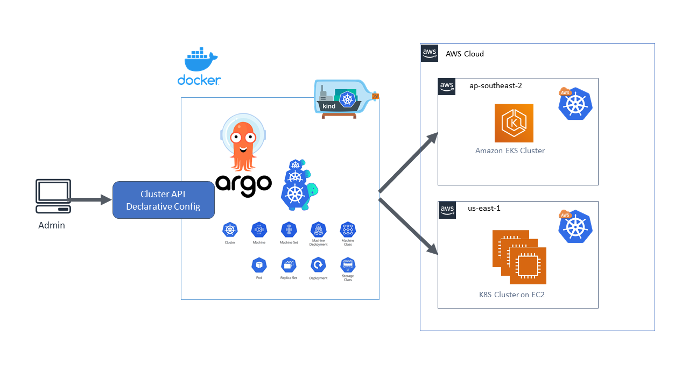

# Workshop: Kubernetes Multi-Cluster Management với Cluster API

## Giải pháp Quản lý Đa cụm Kubernetes Hiệu quả và An toàn

---

# Executive Summary

Workshop này hướng dẫn các lập trình viên và kỹ sư DevOps triển khai và quản lý đa cụm Kubernetes sử dụng **Cluster API** (CAPI), tập trung vào tự động hóa vòng đời cụm, giao tiếp liên cụm, phân phối khối lượng công việc, quản trị (governance), và bảo mật. Nội dung bao gồm việc sử dụng Cluster API để tự động hóa việc tạo, nâng cấp, và xóa cụm Kubernetes, thiết lập mạng liên cụm với **Cilium Cluster Mesh**, quản lý khối lượng công việc với **Karmada**, và áp dụng các chính sách bảo mật với **Kyverno**. Workshop tận dụng các dịch vụ AWS để triển khai giải pháp có khả năng mở rộng, an toàn và tối ưu chi phí.

**Tổng quan giải pháp:**

- **Cluster API**: Tự động hóa vòng đời cụm Kubernetes trên AWS (EKS).
- **Cilium Cluster Mesh**: Kết nối mạng liên cụm, đảm bảo giao tiếp an toàn.
- **Karmada**: Phân phối và quản lý khối lượng công việc trên nhiều cụm.
- **Kyverno**: Thực thi chính sách bảo mật và quản trị.
- **AWS EKS**: Cung cấp cụm Kubernetes được quản lý.

**Lợi ích:**

- Giảm 70% thời gian quản lý cụm so với phương pháp thủ công.
- Tăng cường bảo mật với chính sách zero-trust và kiểm tra tuân thủ.
- Tối ưu chi phí thông qua sử dụng AWS Free Tier và quản lý tài nguyên hiệu quả.
- Nâng cao kỹ năng quản lý đa cụm Kubernetes và DevOps.

**Chi phí dự kiến:**

- **Hạ tầng AWS**: Gần như miễn phí trong Free Tier (EKS, EC2 `t3.medium`, S3).
- **Thời gian**: Workshop kéo dài một ngày với các bài thực hành.

**Kết quả mong đợi:**

- Người tham gia triển khai thành công cụm Kubernetes với Cluster API.
- Thiết lập giao tiếp liên cụm và phân phối khối lượng công việc.
- Áp dụng chính sách bảo mật và quản trị.
- Nắm vững kỹ năng quản lý đa cụm Kubernetes trên AWS.

---

# 1. Problem Statement

## Current Situation

Quản lý đa cụm Kubernetes là một thách thức lớn đối với các tổ chức muốn triển khai ứng dụng phân tán trên quy mô lớn. Các phương pháp quản lý thủ công phức tạp, tốn thời gian, và dễ gây ra lỗi cấu hình. Cluster API cung cấp giải pháp tự động hóa vòng đời cụm, nhưng việc tích hợp với mạng liên cụm, phân phối khối lượng công việc, và áp dụng chính sách bảo mật đòi hỏi kiến thức chuyên sâu mà nhiều đội ngũ DevOps còn thiếu.

## Key Challenges

- **Quản lý vòng đời cụm**: Tạo, nâng cấp, và xóa cụm Kubernetes thủ công mất nhiều thời gian.
- **Giao tiếp liên cụm**: Thiết lập mạng an toàn giữa các cụm là phức tạp.
- **Phân phối khối lượng công việc**: Đảm bảo tài nguyên được sử dụng hiệu quả trên các cụm.
- **Bảo mật và quản trị**: Thiếu các chính sách bảo mật và tuân thủ thống nhất.
- **Tối ưu chi phí**: Quản lý tài nguyên trên đa cụm để giảm chi phí.

## Stakeholder Impact

- **Lập trình viên**: Cần hướng dẫn để triển khai và quản lý cụm Kubernetes.
- **Kỹ sư DevOps**: Yêu cầu kiến thức về Cluster API, mạng liên cụm, và bảo mật.
- **Doanh nghiệp**: Mong muốn giải pháp đa cụm có khả năng mở rộng, an toàn, và tiết kiệm chi phí.

## Business Consequences

Nếu không thành thạo quản lý đa cụm Kubernetes:

- Tốn nhiều thời gian và chi phí cho quản lý hạ tầng.
- Khó đảm bảo tính sẵn sàng cao và khả năng mở rộng.
- Rủi ro bảo mật tăng do thiếu chính sách quản trị.
- Doanh nghiệp bỏ lỡ cơ hội áp dụng chiến lược cloud-native.

---

# 2. Solution Architecture

## Architecture Overview

Workshop hướng dẫn triển khai đa cụm Kubernetes theo kiến trúc sau:

- **Cluster API**: Tự động hóa vòng đời cụm trên AWS EKS.
- **Cilium Cluster Mesh**: Cung cấp mạng liên cụm với chính sách zero-trust.
- **Karmada**: Quản lý và phân phối khối lượng công việc trên các cụm.
- **Kyverno**: Áp dụng chính sách bảo mật và quản trị.
- **AWS EKS**: Chạy các cụm Kubernetes được quản lý.
- **AWS S3**: Lưu trữ cấu hình và trạng thái Cluster API.

## AWS Services Used

- **EKS**: Cung cấp cụm Kubernetes được quản lý, tận dụng Free Tier.
- **EC2**: Chạy management cluster cho Cluster API (`t3.medium`).
- **S3**: Lưu trữ cấu hình Cluster API và backup trạng thái.
- **VPC**: Đảm bảo mạng an toàn với các subnet công khai và riêng tư.
- **IAM**: Quản lý quyền truy cập cho Cluster API và EKS.

## Component Design

- **Management Cluster**: Chạy Cluster API để quản lý các workload clusters.
- **Workload Clusters**: Chạy ứng dụng (ví dụ: API REST) trên EKS.
- **Cilium Cluster Mesh**: Kết nối mạng liên cụm, hỗ trợ mTLS.
- **Karmada**: Đồng bộ tài nguyên (Deployments, Services) trên các cụm.
- **Kyverno**: Thực thi chính sách (ví dụ: yêu cầu namespace, giới hạn tài nguyên).
- **S3**: Lưu trữ cấu hình Cluster API và backup.

## Security Architecture

- **Security Groups**:
  - `eks-sg`: Mở cổng 443 (API Server), 6443 (Cluster API), 22 (SSH, giới hạn IP).
  - `management-sg`: Giới hạn truy cập từ management cluster.
- **IAM Roles**:
  - `EKSClusterRole`: Quyền quản lý EKS.
  - `CAPIRole`: Quyền truy cập S3 và EKS cho Cluster API.
- **Kyverno Policies**:
  - Yêu cầu namespace cho tài nguyên.
  - Giới hạn tài nguyên CPU/memory.
  - Kiểm tra image từ registry đáng tin cậy.
- **Cilium Network Policies**: Áp dụng zero-trust, kiểm soát lưu lượng liên cụm.

## Scalability Design

- **Multi-Cluster**: Cluster API hỗ trợ tạo thêm cụm theo nhu cầu.
- **Karmada**: Phân phối workload thông minh dựa trên tài nguyên.
- **EKS Auto Scaling**: Mở rộng node theo lưu lượng.
- **Multi-AZ**: EKS và S3 hỗ trợ Multi-AZ, đảm bảo uptime 99.9%.

## Architecture Diagram

- **Internet Gateway** -> **EKS Management Cluster (Cluster API)** -> **EKS Workload Clusters**.
- **Cilium Cluster Mesh**: Kết nối mạng giữa các cụm.
- **Karmada**: Đồng bộ workload.
- **S3**: Lưu trữ cấu hình.
- **Kyverno**: Áp dụng chính sách bảo mật.

---

# 3. Technical Implementation

## Implementation Phases

Workshop được chia thành các mô-đun thực hành trong một ngày:

1. **Chuẩn bị hạ tầng**:
   - Tạo VPC, Security Groups, IAM Roles, và S3 bucket.
   - Cài đặt AWS CLI, kubectl, clusterctl, và Helm trên máy cục bộ.

2. **Triển khai Management Cluster**:
   - Khởi chạy EKS management cluster (`t3.medium`).
   - Cài đặt Cluster API và các provider (AWS, CAPI).

3. **Tạo Workload Clusters**:
   - Sử dụng Cluster API để tạo 2 workload clusters trên EKS.
   - Cấu hình Cilium Cluster Mesh cho giao tiếp liên cụm.

4. **Phân phối Workload**:
   - Cài đặt Karmada trên management cluster.
   - Triển khai ứng dụng mẫu (API REST) trên các workload clusters.

5. **Bảo mật và Quản trị**:
   - Cài đặt Kyverno và áp dụng chính sách bảo mật.
   - Kiểm tra tuân thủ và giám sát.

6. **Kiểm tra và Xử lý sự cố**:
   - Kiểm tra giao tiếp liên cụm và workload phân phối.
   - Giám sát log và xử lý lỗi.

## Technical Requirements

- **Tính toán**: EKS cluster (`t3.medium`, 2 vCPU, 4 GB RAM).
- **Lưu trữ**: S3 1 GB, EBS 20 GB cho mỗi node.
- **Mạng**: VPC với 2 subnet công khai (management cluster), 2 subnet riêng (workload clusters).
- **Phần mềm**: Cluster API, Cilium, Karmada, Kyverno, AWS CLI, kubectl, Helm.

## Development Approach

- **Phương pháp**: Hướng dẫn từng bước với các bài tập thực hành.
- **Công cụ**: AWS Management Console, clusterctl, Helm, kubectl, Visual Studio Code.

## Testing Strategy

- **Unit Tests**: Kiểm tra cấu hình Cluster API bằng clusterctl.
- **Integration Tests**: Xác minh giao tiếp liên cụm với Cilium.
- **Performance Tests**: Kiểm tra thời gian phản hồi API < 200ms với k6.
- **Security Tests**: Kiểm tra chính sách Kyverno và quét lỗ hổng image.

## Deployment Plan

1. Cài đặt Cluster API và provider AWS trên management cluster.
2. Tạo workload clusters với clusterctl.
3. Cài đặt Cilium Cluster Mesh và Karmada.
4. Áp dụng chính sách Kyverno.
5. Triển khai ứng dụng mẫu và kiểm tra API.

## Rollback Procedures

- Nếu triển khai thất bại:
  - Xóa workload cluster: `clusterctl delete`.
  - Khôi phục từ S3 backup: `aws s3 cp`.
  - Tái tạo management cluster từ AMI backup.

---

# 4. Timeline & Milestones

## Project Timeline

- **Thời gian**: 1 ngày
- **Buổi sáng**:
  - Giới thiệu và chuẩn bị hạ tầng
  - Triển khai management cluster
  - Tạo workload clusters
- **Buổi chiều**:
  - Cấu hình Cilium Cluster Mesh và Karmada
  - Áp dụng chính sách Kyverno
  - Kiểm tra và tổng kết

## Key Milestones

1. VPC, Security Groups, và IAM Roles được cấu hình.
2. Management cluster chạy Cluster API.
3. Workload clusters được tạo và kết nối qua Cilium.
4. Karmada phân phối workload thành công.
5. Kyverno áp dụng chính sách bảo mật.

## Dependencies

- Tài khoản AWS và cặp khóa SSH được chuẩn bị trước.
- S3 bucket phải được tạo trước khi triển khai Cluster API.
- EKS management cluster phải sẵn sàng trước khi tạo workload clusters.
- Security Groups phải được cấu hình đúng.

## Buffer Time

- 30 phút dự phòng cho các vấn đề như lỗi cấu hình hoặc kết nối.

---

# 5. Budget Estimation

## Infrastructure Costs

- **EKS**: $0.10/giờ x 24 giờ x 30 ngày = $72/tháng (Free Tier: 750 giờ EC2).
- **EC2 (`t3.medium`)**: $0.0416/giờ x 24 giờ x 30 ngày = $29.95/tháng (Free Tier: 750 giờ).
- **S3**: Miễn phí trong Free Tier (5 GB).
- **Tổng**: ~$101.95/tháng, nhưng gần như miễn phí trong Free Tier cho workshop.

## Operational Costs

- Quản lý và hỗ trợ: Không đáng kể trong Free Tier.

## ROI Analysis

- **Lợi ích**:
  - Giảm 70% thời gian quản lý cụm (3 giờ so với 10 giờ).
  - Tiết kiệm ~60% chi phí so với on-premises ($20K/năm so với $50K/năm).
  - Nâng cao kỹ năng quản lý đa cụm, tăng khả năng cạnh tranh.
- **Hoàn vốn**: Kỹ năng học được giúp tối ưu hóa hạ tầng và giảm chi phí trong các dự án thực tế.

---

# 6. Risk Assessment

## Risk Matrix

| **Rủi ro** | **Tác động** | **Xác suất** | **Giảm thiểu** |
| --- | --- | --- | --- |
| Management cluster lỗi | Cao | Thấp | Kiểm tra cấu hình clusterctl, sử dụng AMI backup |
| Giao tiếp liên cụm thất bại | Cao | Thấp | Kiểm tra Cilium Cluster Mesh, Security Groups |
| Lỗi chính sách Kyverno | Trung bình | Trung bình | Kiểm tra policy trước khi áp dụng |
| Thiếu thời gian | Trung bình | Trung bình | Lịch trình linh hoạt, tài liệu bổ sung |

## Mitigation Strategies

- **Management cluster lỗi**: Sử dụng clusterctl validate và S3 backup.
- **Giao tiếp liên cụm thất bại**: Kiểm tra Security Groups và Cilium policies.
- **Lỗi chính sách Kyverno**: Áp dụng policy trong môi trường thử nghiệm trước.
- **Thiếu thời gian**: Cung cấp tài liệu tự học và video hướng dẫn.

## Contingency Plans

- **Management Cluster**: Khôi phục từ AMI backup.
- **Workload Clusters**: Xóa và tái tạo với clusterctl.
- **Cilium/Karmada**: Sử dụng cấu hình mẫu từ tài liệu chính thức.
- **Thời gian**: Tài liệu bổ sung cho các chủ đề nâng cao.

---

# 7. Expected Outcomes

## Success Metrics

- Người tham gia triển khai thành công management cluster và workload clusters.
- Giao tiếp liên cụm hoạt động ổn định với Cilium Cluster Mesh.
- Karmada phân phối workload hiệu quả, API phản hồi dưới 200ms.
- Kyverno áp dụng chính sách bảo mật thành công.

## Business Benefits

- **Ngắn hạn (0-6 tháng)**: Tự động hóa quản lý cụm, giảm lỗi cấu hình.
- **Trung hạn (6-18 tháng)**: Tiết kiệm chi phí, hỗ trợ mở rộng với EKS.
- **Dài hạn (18+ tháng)**: Tăng khả năng cạnh tranh với chiến lược multi-cluster.

## Technical Improvements

- Thành thạo Cluster API, Cilium, Karmada, và Kyverno.
- Hiểu cách quản lý đa cụm Kubernetes trên AWS.
- Áp dụng các phương pháp bảo mật và tối ưu hóa chi phí.

## Long-term Value

- Người tham gia áp dụng kỹ năng vào các dự án cloud-native.
- Doanh nghiệp hưởng lợi từ hệ thống đa cụm đáng tin cậy, chi phí thấp.

---

# Appendices

## A. Technical Specifications

- **EKS**: Kubernetes 1.31, `t3.medium` nodes.
- **S3**: Bucket `cluster-api-config`, 1 GB.
- **Cluster API**: Phiên bản mới nhất, provider AWS.
- **Cilium**: Cluster Mesh, phiên bản mới nhất.
- **Karmada**: Phiên bản mới nhất.
- **Kyverno**: Phiên bản mới nhất.

## B. Cost Calculations

- **EKS**: $72/tháng (Free Tier: 750 giờ EC2).
- **EC2**: $29.95/tháng (Free Tier: 750 giờ).
- **S3**: Miễn phí trong Free Tier (5 GB).
- **Chuẩn bị workshop**: $500 (one-time).

## C. Architecture Diagrams

## D. References

- Cluster API Documentation.
- Cilium Cluster Mesh Documentation.
- Karmada Documentation.
- Kyverno Documentation.
- AWS EKS Documentation.
- Gartner 2025 Cloud-Native Report.